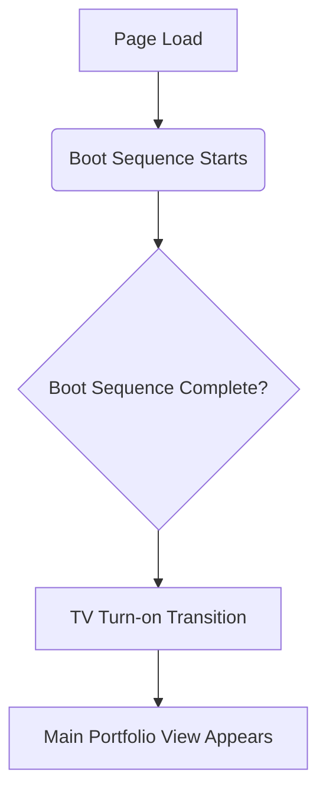
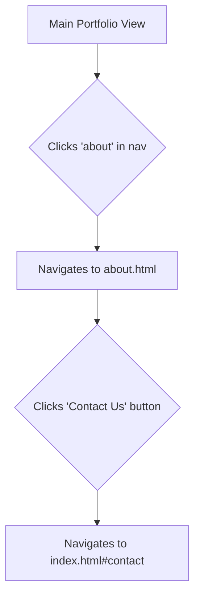

# Ghostwire • Collective UI/UX Specification

## Introduction
This document defines the user experience goals, user flows, and visual design specifications for the Ghostwire • Collective portfolio. It serves as the foundation for the frontend architecture and development, ensuring a cohesive, immersive, and high-impact user experience that is perfectly aligned with the finalized Project Requirements Document (PRD v2.4).

### Overall UX Goals & Principles
*   **Primary Goal**: To create a deeply impressive and memorable showcase of technical and creative skill for pre-qualified freelance clients.
*   **Core Design Principle**: **"Smooth & High-Tech with a Pinch of Glitch."** The primary experience is polished, fluid, and futuristic. Glitch effects are used sparingly as high-impact accents to add character and support the hacker theme, not to distract or overwhelm.
*   **Supporting Principles**:
    *   **Immersive Journey**: From the moment the page loads, the user should be transported into the portfolio's world. Every transition and interaction should maintain this immersion.
    *   **Focused Showcase**: The design must guide the user's attention directly to the projects. All non-essential elements are removed to maintain focus.

### Change Log
| Date | Version | Description | Author |
| --- | --- | --- | --- |
| 2025-08-11 | 1.0 | Initial draft of the UI/UX Specification. | Sally (UX) |
| 2025-08-11 | 2.0 | **Final version incorporating all PRD requirements, including the two-page structure and interactive terminal.** | Sally (UX) |

## Information Architecture (IA)
The application consists of two main pages, creating a focused journey from the main showcase to a detailed overview of the collective's capabilities.

```mermaid
graph TD
    A[Main Page (index.html)]
    B[About Page (about.html)]

    A -- "User clicks 'about' nav link" --> B
    B -- "User navigates back or clicks 'Contact Us'" --> A
```
*   **`index.html`**: The primary immersive experience, containing the boot sequence, main portfolio, and project showcase.
*   **`about.html`**: A dedicated page containing detailed information about the collective.

## User Flows

### Flow 1: The Grand Opening
**User Goal**: To be guided through an impressive portfolio launch sequence.


### Flow 2: Project Exploration
**User Goal**: To view the details of a specific project.
```mermaid
graph TD
    A[Main Portfolio View] --> B{User Clicks Project Card};
    B --> C[Loading Bar Appears];
    C --> D{Loading Complete?};
    D --> E[Project Modal Opens];
    E --> F{User Clicks "View Live Project"};
    F --> G[Opens Link in New Tab];
    E --> H{User Closes Modal};
    H --> A;
```

### Flow 3: Learning More
**User Goal**: To understand the collective's expertise and get in touch.


## Component Library / Design System

### Project Cards
*   **Purpose**: To display individual projects in the main grid.
*   **Style**: Retains the original dark, semi-transparent look but with refined borders.
*   **States**:
    *   **Default**: As per the original design.
    *   **Hover**: The card's border color will brighten, the `box-shadow` will deepen for a sense of depth, and the "shine" effect will be more pronounced. The card will tilt slightly towards the cursor.

### Modal Window
*   **Purpose**: To showcase the project video.
*   **Style**: Clean, sharp, and high-tech. A dark, blurred background (`backdrop-filter`) with a crisp border. No unnecessary chrome or decoration.

### Loading Bar
*   **Purpose**: To bridge the gap between clicking a project and the modal appearing.
*   **Style**: A sleek, thin horizontal bar that appears in the center of the screen.
*   **Animation**: Fills smoothly from 0% to 100%. Upon completion, it will trigger the "data corruption" glitch effect before disappearing.

### "Contact Us" Button (on About page)
*   **Purpose**: To provide a clear path back to the contact section on the main page.
*   **Style**: Consistent with the polished, high-tech aesthetic of the project cards.
*   **Hover State**: A subtle glow and brightening effect.

## Animation & Micro-interactions

### TV Turn-on Effect
*   **Goal**: Create a satisfying transition from the boot screen to the main portfolio.
*   **Specification**:
    1.  The screen is black.
    2.  A single, bright horizontal line appears in the vertical center of the screen.
    3.  A split-second of "static" and a subtle RGB-split "glitch" flickers over the line.
    4.  The line smoothly and rapidly expands vertically to fill the screen, revealing the main portfolio view behind it.

### Matrix Background
*   **Goal**: Refine the background to look more sophisticated.
*   **Specification**:
    1.  The character set will be replaced with a curated list of esoteric Unicode characters (e.g., Katakana, box-drawing symbols, block elements).
    2.  The animation will introduce subtle variations in the falling speed of different columns and a "flicker" effect on some characters.

### Loading Bar & Glitch
*   **Goal**: Make the loading experience part of the theme.
*   **Specification**:
    1.  The loading bar appears and fills smoothly over 1-1.5 seconds.
    2.  When it reaches 100%, it flashes brightly.
    3.  For a few frames (approx. 100-150ms), a "glitch" effect is applied to the bar.
    4.  The bar vanishes, and the modal transition begins immediately.

### Modal Transitions
*   **Goal**: Make the project showcase feel fluid and impressive.
*   **Specification**:
    *   **Opening**: The modal will animate in using a combination of `scale` (from 0.95 to 1) and `opacity` (from 0 to 1). The first few frames of the animation will feature a subtle pixelation effect that quickly resolves into the clean, final modal state.
    *   **Closing**: The modal will smoothly fade and scale down without any glitch effect.

## Terminal Interaction
*   **Purpose**: To act as a themed "About" section on the main page while providing an authentic, interactive feel.
*   **Initial State**: On page load, the terminal will display the pre-defined `Terminal Initial Display Content` from the PRD, followed by a command prompt (`guest@portfolio:~$`) and a blinking cursor.
*   **User Input**: The user can type freely into the input field. The input field is fully functional.
*   **System Response**: When the user presses `Enter`, the system will print a new line with the error message `command not found: [user's input]` styled in red. A new, empty command prompt will then appear.
*   **Event-Driven Output**: The terminal must be able to receive and display messages from other UI elements, specifically the "switch" button in the navigation bar. When the "switch" button is clicked, the corresponding theme change text will be printed to the terminal, followed by a new command prompt.

## Responsiveness Strategy
*   **Breakpoints**: This experience is designed and optimized for desktop displays.
*   **Adaptation**: Mobile responsiveness is not a primary requirement for this version.

## Next Steps
*   **Handoff to Architect**: This specification is now ready for Winston (Architect) to create the technical `architecture.md`. He will use these detailed animation, interaction, and structural descriptions to design a performant and modular technical solution.
*   **Design Handoff Checklist**:
    *   [x] All user flows documented, including the two-page structure.
    *   [x] Component inventory and states defined.
    *   [x] Animation and motion principles are clear.
    *   [x] Terminal interactivity is explicitly defined.
    *   [x] All final copy from the PRD is accounted for.
